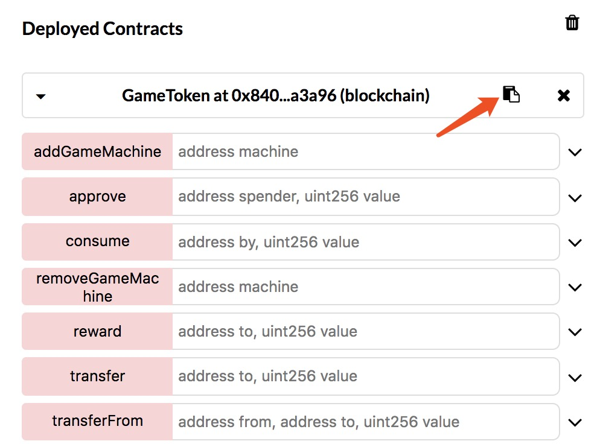

# Tutorial

## Overview 

This tutorial includes three part: *Deploy and Make Contract Public*, *From contract to a web app*, and *Appendix*. Part one is about deploying a contract in public ethereum testnet. Part two elaborates on our demo on the basis of this contract and summarizes all the important notes. Part three introduces all the programming tools used.

## Deploy and Make Contract Public

### 1. Introduction

In this part, [*Kovan Etherscan*](https://kovan.etherscan.io/) (One of ethereum testnet) is used for contract deployment. Before the actual deployment, it is required to install [chrome](https://www.google.com/chrome/) and [Metamask](https://metamask.io/) extension. With *Metamask* (a pretty GUI), you don't have to run your own node. See details below.

### 2.  Open Metamask

After installing MetaMask, you can find MetaMask icon (a fox) on top right. Click it. For consideration of compatibility issues, please try the new version of *MetaMask*.

### 3. Create your account 

1. Click continue, please follow the instructions to create an account. 

1. After a few simple steps, you will see the "Secret Backup Phrase". Save it to a 
convenient place.  Soon we will use it to finish the creation.

> "Secret Backup Phrase" can be used to recover your account. 

### Connect to Kovan Test Network

By default, "Main Ethereum Network" is used for contract deployment. Switch to "Kovan Test Network".

### 4. Get test ether 

For convinience, you can visit this [Demo Faucet](http://private.secdevgame.site/#/faucet) to get 0.01 ether for test. Or you can visit [Kovan faucet](https://gitter.im/kovan-testnet/faucet), send out your address and wait for administrator to give you 3 ether.

### 5.Open Remix && Connect to Kovan

1. Click [here](https://remix.ethereum.org) to open remix. 
> Remix is an online IDE for Solidity(A official programming language for smart contract). It is quite easy to use Remix for contract compilation and deployment . 

2. Click *Run* on the right top and alter the Enviroment to "Injected Web3". As we are using *Metamask*, we connect to Kovan here.

### 6.Compile contract 

1. For the first time, remix will generate a simple "ballot.sol" contract for us. Replace the content with our token contract. And then paste our demo code to the editor. You can find the code [here].(https://github.com/CongGroup/SecDev2018-tutorial/blob/master/contract/DemoToken.sol)

2. Click compile. It displays all the information of the compiler. By default, the current version is "0.4.25+commit.59dbf8f1.Emscripten.clang" and you don't have to change it. In case it's different, you can choose it at the very beginning of dropdown item (show in the second picture below).

3. Select "Enable Optimation" and click "Start to compile"

 

Note: Check the following image if your have trouble following step 2 in this session.

  

 

### 7. Deploy Contract

After compilation, it's time to deploy the contract. The contract constructor has four arguments:

* Amount of token to supply (uint)
* Name of token		            (string)
* Symbol of token	            (string)
* Token Decimal                   (uint). As there is no **float** type now, your may need define decimal.

Possible arguments: 10000, "DemoToken","DMT", 10

1. Input the example arguments and click "Deploy".

2. Now you can see your receipt on the left of the screen. Confirm it and waiting for several seconds, your contract will be deployed.

3. After a short while, you can check your deployed contract. Please copy the contract address. Later it can be used to check your contract status in "Etherscan". **Do not close remix until this part end !!**

### 8. Make your contract public in Etherscan

1. Open [Kovan Etherscan](https://kovan.etherscan.io/). Use your contract address to query your contract status. 

> In Etherscan, you can check every transaction and see the source code of every deployed contract. To make your contract reliable for others, it's better to publish your contract.

1. At this moment, you can only see your contract bytecode or opcode. Click "Verify and Publish" to publish your source code.

3. Input your contract name, choose the compiler version and the soruce code. Then you can verify and publish your source code.

4. Now your source code is viewable for everyone.

## From contract to a web app

### 1. Introduction

In this part, detailed explanation of the demo is provided. There are altogether two versions of demo. One is built on the public chain while the other is built on the private chain and the public chain. The functions of the former version is included in the latter version. After going through the former version, you can have a better understanding upon why we use the private chain here. 

The former version is [here](http://public.secdevgame.site), which is built on the public chain

The latter version is [here](http://private.secdevgame.site), which is built on the private chain and the public chain.

In addition, important notes are summarized about implementing such a demo in general.

### 2. Demo Show
(这部分我等会优化下前端再补充图片)

1. Create your account and log in.

2. Get some ether for test

3. Now you can start to play game machine! Input your bet amount and run slotmachine. 5 rounds you will get one token for reward.

4. Consume 2 tokens, you can get into a *Double* state, where in 4 rounds, your reward will be doubled.

5. (This part is only showed in the latter version) Look into wallet, you can transfer your token between our private chain and our public chain. After input amount of token to transfer, click *exchange* button and input your password, you will send a transaction signed by your account to our server. Our server will send this signed transaction to public or private chain.

### 3. Implementation in general.

As the function of the former version is included in the latter version, I only introduce the latter version here.

 
Following picture is the overview architecture. In fact, bridge is a part of server.  I list it as a seperate part for its sepecial meaning. Now let us review our demo and see what actually happended in behind. Then the meaing of this picture will be clear. In the end, I will list programming tools to build this demo.

  

1. Create your account and login in.

Here use [eth-lightwallet](https://github.com/ConsenSys/eth-lightwallet) to create your wallet. Your wallet is actually created and stored in your browser. Later you can use this wallet to create and sign a transaction.

2. Get some ether for test.

When you require ether in the web page, a http request will send to our server.  In our server side, a [parity](https://wiki.parity.io/)(a ethereum client like geth) node connected to kovan testnet is running. After our server receive your request, we will create a transfer transaction and send it to our node. 

3. Play game machine and reward your token.

The game machine is just a `js` stuff. Every time you play 5 rounds,  a http request is sent to our server. In our server side, a private chain composed of three node is running. After our server receive the request, we will call a function in our contract and send this transaction to the chain.

4. Consume 2 tokens, you can get into a *Double* state, where in 4 rounds, your reward will be doubled.

This step is completely implemented by `js`.

5. Exchange tokens between private chain and public chain in wallet.

* When you click *exchange* button, you use your wallet to create a transaction and use your input password to sign the transaction. 
* Then the transaction is contained in http request send to our server. Our server send this transaction to public chain or private chain for you according to your choice. 
* Suppose the transaction is sent to public chain and the public chain excecutes it, reduces you token amount in the public chain, and emits an event(you can see there are event defined in our contract). 
* Our bridge, a js program that is listening on such an event will catch this event, and send another transaction to the private chain to increase your token amount in the private chain. 
* It's totally the same process if you want to exchange your tokens to the other side.
 
 
## Appendix

* Public Chain: Kovan. We use [Parity](https://wiki.parity.io/) client to connect to Kovan.
* Private Chain: [Geth](https://github.com/ethereum/go-ethereum), with POA as concensus algorithm
* API to interact with two chain: [web3js](https://web3js.readthedocs.io/en/1.0/index.html)
* Backend : [Koa](https://github.com/koajs/koa)
* Frontend: [Vue](https://vuejs.org/)
