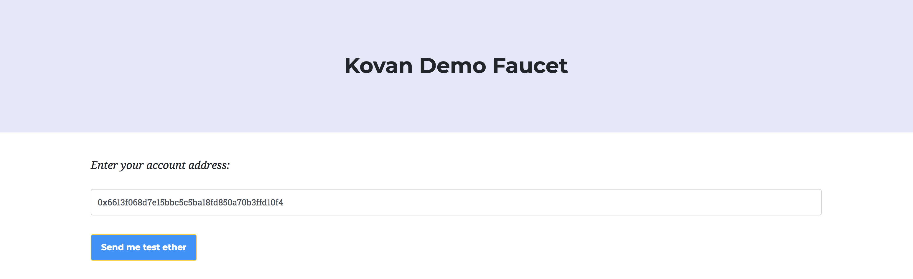
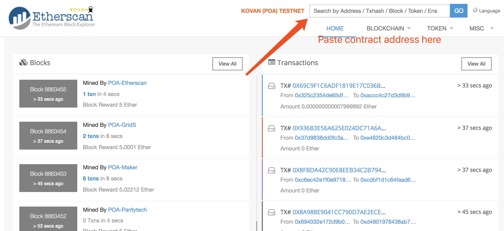
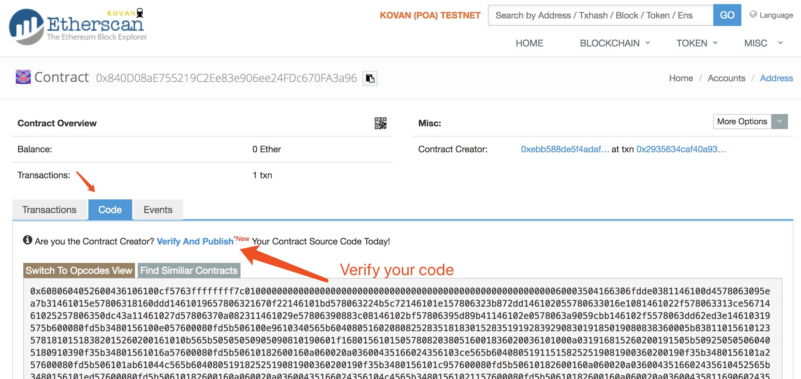
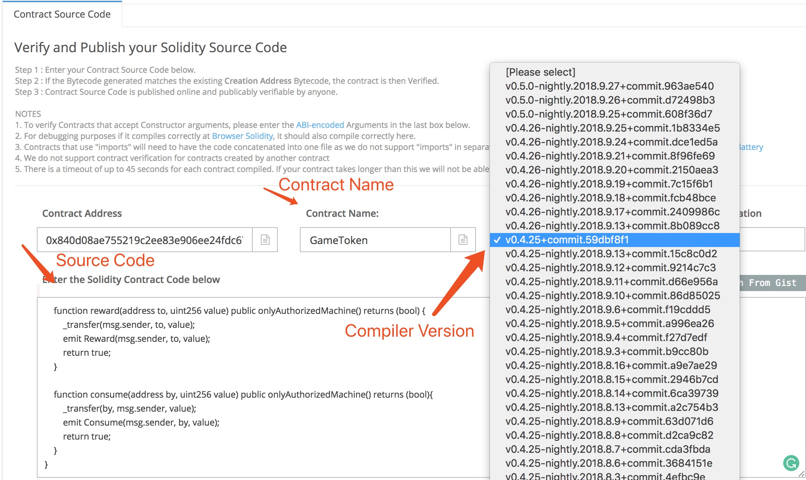
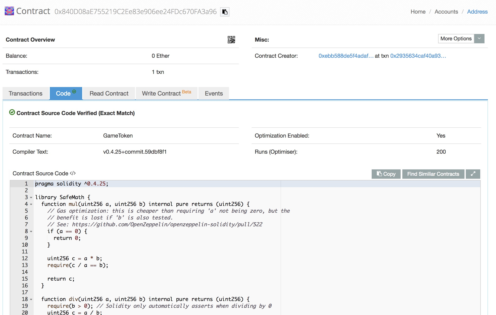
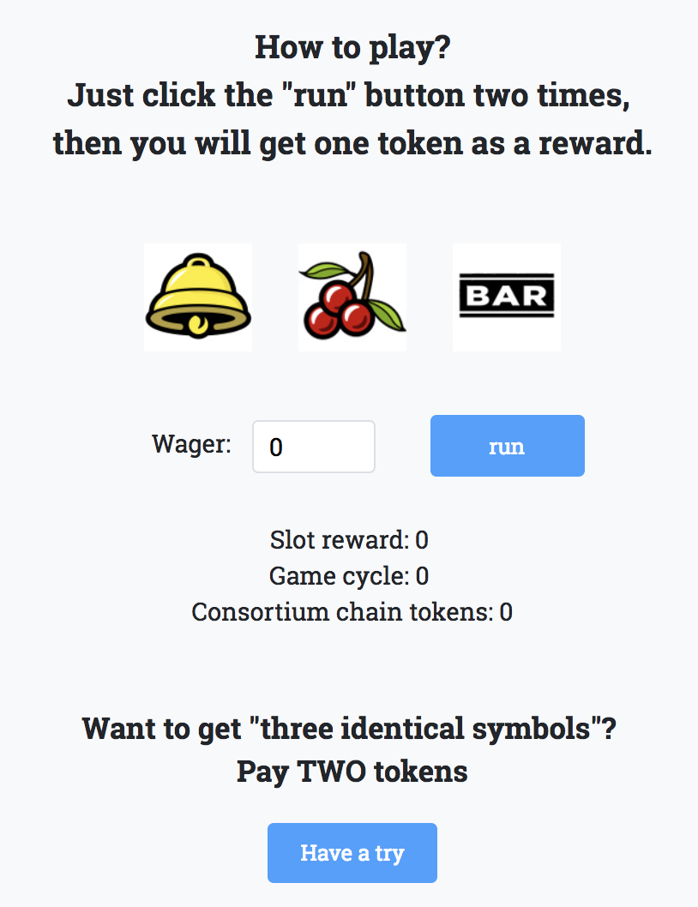
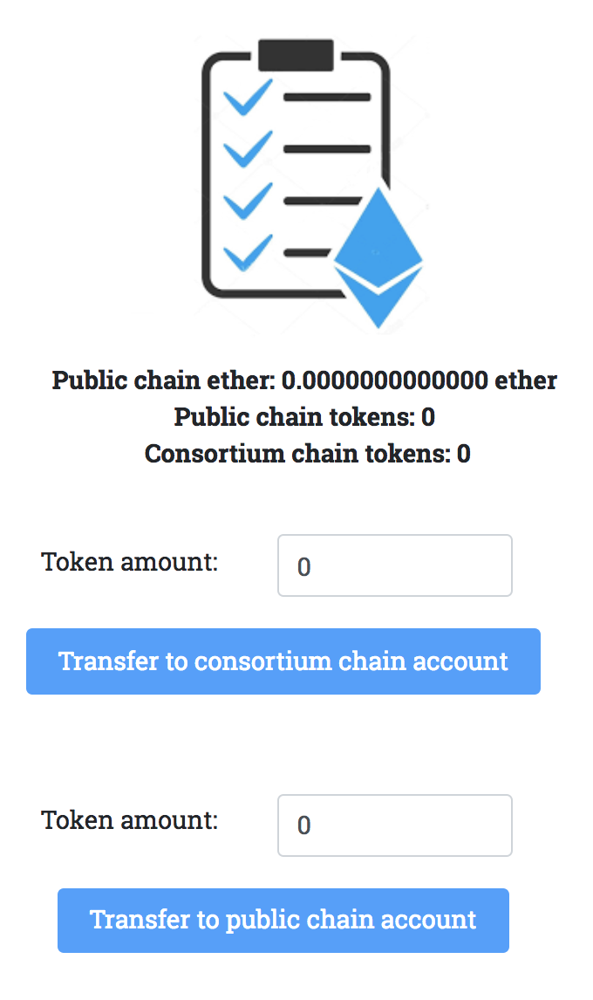

## Statement
This document is coupled with our tutorial at [IEEE SecDev2018](https://secdev.ieee.org/2018/agenda/), **Building Secure and Trustworthy Blockchain Applications** [[pdf](https://secdev.ieee.org/wp-content/uploads/2018/09/SecDev-Tutorial-Building-Secure-Consortium.pdf)] [[slides](https://www.dropbox.com/s/uzc43xhjul160i0/secdev2018-slides.pdf?dl=0)]. 

Two demo links (only available from 29 Sep 2018 to 3 Oct 2018):

* Demo on public chain: [public.secdevgame.site](https://public.secdevgame.site)
* Demo on public chain and consortium chain: [consortium.secdevgame.site](https://consortium.secdevgame.site)

## Overview 

This tutorial includes three part: **Deploy and Make Contract Public**, **From Contract to a Web App**, and **Appendix**. Part one is about compiling and deploying the GameToken contract to Kovan testnet. Part two elaborates on our demo on the basis of this contract and summarizes all the important notes. Part three introduces all the programming tools used.

## Part One: Deploy and Make Contract Public

### 1. Introduction

In this part, [*Kovan Etherscan*](https://kovan.etherscan.io/) (one of the ethereum testnets) is used for contract deployment. Before the actual deployment, it is required to install [chrome](https://www.google.com/chrome/) and [MetaMask](https://metamask.io/) extension. With *MetaMask* (a pretty GUI), you don't have to run your own node. See details below.

### 2. Lauch MetaMask

1. After installing MetaMask, you can find MetaMask icon (a fox) on the top right. Click it. 
2. Click "TRY IT NOW" to use the new version.

### 3. Create a new MetaMask account 

   1. Create a password

   2. After a few simple steps, you will see the "Secret Backup Phrase". Save it to a convenient place. We will use it in step 3
   

    
   3. Confirm the key phrase generated in step 2

### 4. Connect to "Kovan Test Network"

By default, "Main Ethereum Network" is used for contract deployment. In this tutorial, please switch to "Kovan Test Network".

### 5. Get test ether 

For convenience, you can visit this [Demo Faucet](http://private.secdevgame.site/#/faucet) to get 0.01 ether for the test. Or you can visit [Kovan faucet](https://gitter.im/kovan-testnet/faucet), send out your address, and wait for an administrator to give you 3 ethers.

### 6. Open Remix & Connect to Kovan

  1. Click [here](https://remix.ethereum.org) to open Remix. 
> Remix is an online IDE for Solidity (An official programming language for smart contract). It is quite easy to use Remix for contract compilation and deployment. 

  2. Click `Run` on the right top and alter the Environment to `Injected Web3`. As we are using **MetaMask**, we connect to Kovan here.

### 7. Compile contract 

  1. For the first time, Remix will generate a simple "ballot.sol" contract for us. Replace the content with our customized token contract. And then paste our demo code to the editor. You can find the code [here](https://github.com/CongGroup/SecDev2018-tutorial/blob/master/contract/DemoToken.sol).

  2. Swith to compile tab, It displays all the information of the compiler. Make sure Enable Optimization is checked.
  	
 

  3. Select compiler version. `0.4.25+commit.59dbf8f1.Emscripten.clang` 
  	
  

  4. Click Start to compile.

### 8. Deploy Contract

After compilation, it's time to deploy the contract. The contract constructor has four arguments:

* Amount of the token to supply (uint)
* Name of the token (string)
* Symbol of the token (string)
* Token Decimal (uint). As there is no **float** type now, you may need to define decimal.

Possible arguments: **10000, "DemoToken","DMT", 10**.

  1. Input the example arguments and click `Deploy`.

  2. Now you can see your receipt on the left of the screen. Confirm it and waiting for several seconds, your contract will be deployed.

  3. After a short while, you can check your deployed contract. Please copy the contract address. Later it can be used to check your contract status in **Etherscan**. **Do not close remix until this part end !!**

### 9. Make your contract public in Etherscan

  1. Open [Kovan Etherscan](https://kovan.etherscan.io/). Use your contract address to query your contract status. 

> In Etherscan, you can check every transaction and see the source code of every deployed contract. To make your contract reliable for others, it's better to publish your contract.

  2. At this moment, you can only see your contract bytecode or opcode. Click `Verify and Publish` to publish your source code.

  3. Input your contract name, choose the compiler version and the source code. Then you can verify and publish your source code.

  4. Now your source code is available for public review.

## Part Two: From Contract to a Web App

### 1. Introduction

In this part, the detailed explanation of the demo is provided. There are altogether two versions of the demo. One is built on the public chain only while the other is built on both the consortium chain and the public chain. The functions of the former version are included in the latter version. After going through the former version, you can have a better understanding of why we use the consortium chain here. 

The former version is [here](https://public.secdevgame.site), which is built on the public chain only.

The latter version is [here](https://consortium.secdevgame.site), which is built on the consortium chain and the public chain.

### 2. Demo show

  1. If you don't have an account, create one and sign in. Your generated account will be stored in the browser cookie. If you want to sign in again with the same account, you may need to enable cookie in your browser.

  

	

  

  2. At the top of the web page, you can see our navigation bar, including **Game Machine**, **Wallet**, **Faucet**.

  
 

  3. Go to our faucet and get 0.01 ether for the test.

  

  4. Now you can start to play the game machine! Input your wager amount and run the slotmachine. After four rounds, you will get one token as a reward.

  

  5. Consume 2 tokens, you can get into a **Double** state, where after four rounds, your reward will double.

  

  6. (This part is only shown in the latter version.) Switch to the wallet, you can transfer your token between the consortium chain and the public chain. After inputting the amount of token to transfer, click the `exchange` button, you will send a transaction signed by your account to our server which transfers the transaction to a chain. After a few seconds, you can see your token transferred to the other chain.

  

### 3. Implementation in general.

As the functions of the former version is included in the latter version, the latter version is explained here.
 
The following image illustrates the whole architecture. In fact, the **bridge** is a part of the server. Please watch the demo now for a better understanding.

  

  1. Here I use this library [eth-lightwallet](https://github.com/ConsenSys/eth-lightwallet) to create your wallet. Your wallet is then stored in your browser. Later you can use this wallet to create and sign a transaction.

  2. Get some ethers for the test.

  > When you request ether in the web page, a http request will be sent to the server. On the server side, a [parity](https://wiki.parity.io/) (an ethereum client like geth) node connected to kovan testnet is running. After the server receives your request, a transaction will be sent to the node. 

  3. Play the game machine and reward your token.

  > Every time you play five rounds within the game machine, a http request is sent to the server. On the server side, a consortium chain composed of three nodes is running. After the server receives the request, call a function in the contract and send this transaction to the chain.

  4. Consume two tokens, you can get into a **Double** state, where in four rounds, your reward will double.

  > This part is written in `JavaScript`.

  5. Exchange tokens between the consortium chain and the public chain via the wallet.

  * When you click `exchange` button, you are using your wallet to create and sign a transaction.
  * Then the transaction, wrapped in the http request, is sent to the server. Upon receiving the transaction, the server sends it to the public chain or the consortium chain based on your choice. 
  * Suppose the transaction is sent to the public chain and the public chain executes it, reduces your token amount in the public chain, and emits an event (you can see there are several events defined in the contract). 
  * Our bridge, as a JavaScript program that is listening on such event, will catch this event and send another transaction to the consortium chain to increase your token amount in the consortium chain. 
  * It's exactly the same process if you want to exchange your tokens to the other side.
 
 
## Part Three: Appendix

  * Public Chain: Kovan. We use the [Parity](https://wiki.parity.io/) client to connect to Kovan.
  * Consortium Chain: [Geth](https://github.com/ethereum/go-ethereum), with POA as the concensus algorithm.
  * API to interact with two chains: [web3js](https://web3js.readthedocs.io/en/1.0/index.html).
  * Backend : [Koa](https://github.com/koajs/koa).
  * Frontend: [Vue](https://vuejs.org/).

------
Disclaimer: all the code, documents, and data in this repository are for the tutorial and related hands-on/demonstration only. They are by no means ready for any other use cases beyond the above academic/educational purposes.
